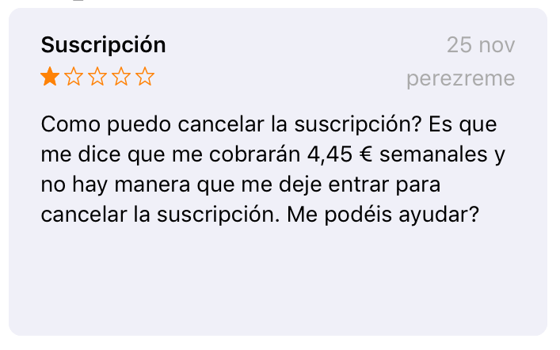
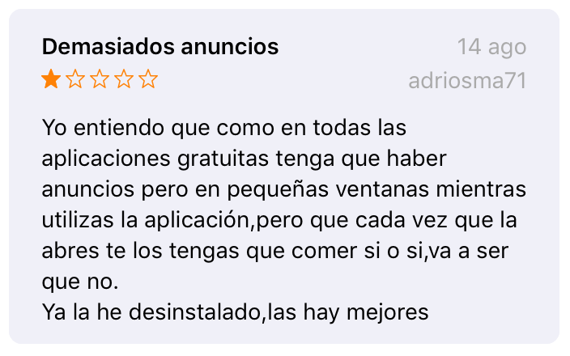
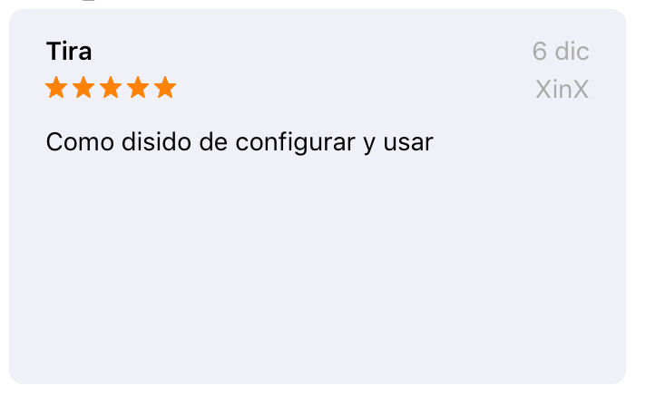
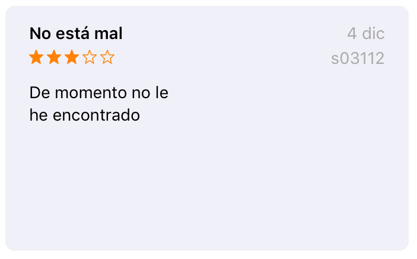

## WhatsPad

### A WhatsApp (web) client for the iPad.

A simple webview that let's you use the WhatsApp web client on your iPad.

#### Motivation: 

I needed a WhatsApp client for my iPad and all of the ones available in the App Store looked a bit suspicious (strange comments). 

#### Run/Install:

1. Open the project in XCode
2. Connect your iOS device
3. Run the project in your device

Example:

#### TODO:

- Publish it on the App Store ($$$)
- Enable notifications